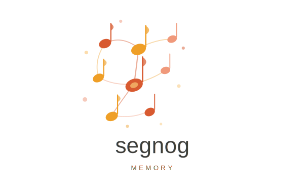
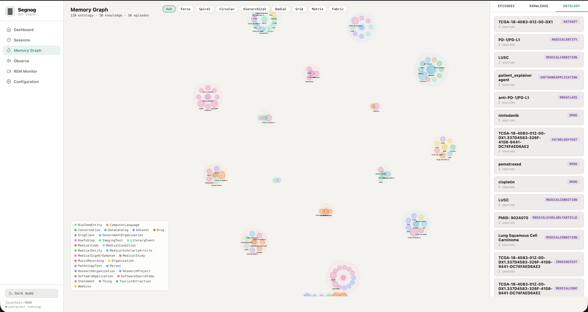

<p align="center">
  
</p>

## Name

> **Dal Segno** — *from the sign*. In music notation, *Dal Segno* instructs the performer to return to the segno mark (𝄋) and replay the passage — but with everything they have learned since the first time. The second pass through is never the same as the first.

## How it stays simple

**One container holds everything.** DragonflyDB (session cache), FalkorDB (long-term graph), NATS (event bus), REST server, gRPC server, MCP server, and background workers all run inside a single Docker container managed by supervisord. There is no external cluster to operate.

**One endpoint does everything.** `/observe` stores the current observation, searches for related memory, and returns a formatted context passage — all in a single call. Reading and writing are not separate operations.

**Data organises itself in the background.** The agent does not decide what is important or how to structure it. After returning the context, Segnog fires background tasks that extract knowledge, identify entities, consolidate episodes, and maintain a graph of who knows what. This happens asynchronously — the agent's response is not delayed.

**Memory has two layers, kept separate.** DragonflyDB is the hot session cache — fast, in-memory, TTL-scoped. FalkorDB is the persistent graph — structured, searchable across sessions. The hot path never touches the graph. The graph is populated in the background, then pulled into the session on the next cold start.

```bash
docker-compose up -d
```

```bash
curl -X POST http://localhost:9000/api/v1/memory/observe \
  -H "Content-Type: application/json" \
  -d '{
    "session_id": "agent-session-42",
    "content": "The user asked about last quarter's deployment incident.",
    "timestamp": "2025-11-01T14:30:00Z",
    "source": "chat"
  }'
```

```json
{
  "episode_uuid": "550e8400-e29b-41d4-a716-446655440000",
  "context": "In Q3, the v2.3 deployment on October 14th caused a memory leak in the worker pool. It was patched in v2.3.1 the following morning after Caroline identified the root cause in the session logs...",
  "session_id": "agent-session-42",
  "parent_session_id": null
}
```

That's it. The agent passes what it sees. Segnog returns what it should remember.

No schema to define. No retrieval logic to write. No storage layer to configure. Segnog decides what to store, what to search, and how to assemble the context. The agent just calls `/observe` at every turn and uses the returned `context` string.

---

## Features

### Memory Architecture

**Two-layer storage.** DragonflyDB holds hot session data (fast, in-memory, TTL-scoped). FalkorDB holds the persistent long-term graph (episodes, knowledge, ontology, causal claims, artifacts). The hot path never touches the graph — reads are always against the cache, writes propagate to the graph in the background.

**Hierarchical sessions.** Sessions nest via `parent_session_id`. A child session automatically inherits context from all ancestors at query time — `subtask-1a` sees everything from `task-1` and `project-x` without extra logic. Links are created lazily on first write.

**3D ranked retrieval.** Observe returns entries ranked by a composite score of semantic similarity (embedding cosine distance), temporal recency (exponential decay with configurable half-life), and Hebbian co-activation strength (entities frequently retrieved together get boosted). Not chronological — most relevant first.

### Automatic Knowledge Extraction

**Per-episode extraction.** Every observation triggers background LLM extraction of structured knowledge facts. No prompting required — the agent just sends content, Segnog extracts `who/what/where/when/why` tuples with typed categories (`[fact]`, `[identity]`, `[event]`, `[conclusion]`, `[experience]`, `[tool_insight]`).

**Schema.org ontology.** Entity extraction uses the full Schema.org vocabulary (930 classes, 1520 properties). Embedding-based class retrieval selects the top-60 most relevant Schema.org types for each observation, so extraction is context-aware without sending the entire taxonomy. Entities are normalized to canonical names and linked via typed relationships (e.g. `Person → worksFor → Organization`).

**Inverse and symmetric inference.** At write time, Segnog auto-stores reverse edges for inverse pairs (`memberOf ↔ member`, `parent ↔ children`) and symmetric predicates (`knows`, `spouse`, `sibling`, `colleague`). A `Person → memberOf → Team` edge automatically creates `Team → member → Person`.

### Causal Reasoning

**Causal belief network.** Segnog extracts causal claims from observations (`X causes Y`), stores them as a directed graph with `CAUSES` edges, and attaches evidence links from knowledge nodes (`SUPPORTS` or `CONTRADICTS`). Each claim has a confidence score computed from the evidence ratio.

**Auto-chaining.** Related causal claims are automatically linked — if one claim's effect matches another's cause, they're chained into a reasoning path. The agent can ask "why does X happen?" and get a multi-hop causal explanation.

**Belief revision.** After each curation cycle, Segnog revises causal claim confidence based on new evidence. Contradicting evidence reduces confidence, supporting evidence increases it — Bayesian update without manual tuning.

### Background Consolidation (REM Sleep)

**REM worker.** A background sweep process runs every 2 minutes (configurable), selecting batches of un-consolidated episodes for processing. This is the "sleep cycle" — while the agent is idle, Segnog organizes what happened.

**Curation pipeline.** For each batch: extract knowledge → consolidate episodes (merge duplicates above 0.90 cosine similarity) → update ontology nodes (re-summarize entity profiles) → run reflection and metacognition → store compressed episode summaries.

**Metacognition.** After each curation, Segnog runs a two-part reflection: (1) a structured summary of what was learned, and (2) a metacognitive analysis of the agent's reasoning quality — identifying patterns, gaps, and biases in the session's decision-making.

**Hebbian learning.** Entities that are frequently co-retrieved develop stronger associative edges over time. This means the more two concepts appear together in relevant context, the more likely they are to surface together in future queries — mimicking biological associative memory.

### Protocols

| Protocol | Endpoint | Transport | Use case |
|---|---|---|---|
| **REST** | `:9000/api/v1/memory` | HTTP JSON | curl, HTTP clients, frameworks |
| **gRPC** | `:50051` | HTTP/2 | high-throughput, low-latency agents |
| **MCP (SSE)** | `:9000/mcp/sse` | Server-Sent Events | Claude Desktop, Claude Code (local) |
| **MCP (Streamable HTTP)** | `:9000/mcp/v1` | HTTP POST/Response | Azure, NGINX, reverse proxies |

### Observability

**Built-in dashboard.** A React UI at `:9000` with seven pages: health grid, reporting with latency percentiles, session tree, interactive ontology graph (hub/force/radial/hierarchical layouts), observe playground, REM monitor, and configuration viewer.

**Deep health checks.** The `/health` endpoint reports individual backend status (DragonflyDB, FalkorDB, NATS) — returns `degraded` if any backend is down instead of silently failing.

**Memory logging.** Every observe exchange is logged with timestamps, stored content, and retrieved context for debugging and audit trails.

---

## Getting Started

### Prerequisites

- [Docker](https://docs.docker.com/get-docker/) and Docker Compose
- An API key for an OpenAI-compatible LLM provider (OpenAI, Anthropic, MiniMax, Together, etc.)
- An API key for an OpenAI-compatible embedding provider (can be the same provider)

Segnog is provider-agnostic. It works with any LLM or embedding service that exposes an OpenAI-compatible `/chat/completions` and `/embeddings` endpoint. You pick your provider and model during setup.

---

### Step 1 — Clone and run setup

```bash
git clone https://github.com/rafiksalama/Segnog.git
cd Segnog
python setup.py
```

The setup wizard will ask for:

| Prompt | What it configures | Default |
|---|---|---|
| LLM base URL | Provider endpoint (must be OpenAI-compatible) | `https://api.openai.com/v1` |
| LLM API key | Secret key for the LLM provider | *(required)* |
| LLM model name | Model used for extraction & reasoning | *(required, e.g. `gpt-4o`, `claude-sonnet-4-20250514`)* |
| Embedding base URL | Provider endpoint for embeddings | `https://api.openai.com/v1` |
| Embedding API key | Secret key (press Enter to reuse LLM key) | Same as LLM key |
| Embedding model | Model for semantic search | *(required, e.g. `text-embedding-3-small`)* |
| REST port | Host port for REST API + UI | `9000` |
| gRPC port | Host port for gRPC | `50051` |

**Example provider setups:**

| Provider | LLM base URL | LLM model | Embedding model |
|---|---|---|---|
| OpenAI | `https://api.openai.com/v1` | `gpt-4o` | `text-embedding-3-small` |
| Anthropic | `https://api.anthropic.com/v1` | `claude-sonnet-4-20250514` | *(use OpenAI or OpenRouter)* |
| MiniMax | `https://api.minimax.io/v1` | `MiniMax-M2.7-highspeed` | *(use OpenRouter)* |
| Together | `https://api.together.xyz/v1` | `meta-llama/Llama-3-70b-chat-hf` | `togethercomputer/m2-bert-80M-8k-retrieval` |
| OpenRouter | `https://openrouter.ai/api/v1` | *(any model)* | `qwen/qwen3-embedding-8b:nitro` |

The wizard automatically detects port conflicts, writes all config files, pulls the Docker image, starts the container, and runs a health check.

**Other modes:**

```bash
python setup.py --quick      # Use existing config, no prompts
python setup.py --skip-pull  # Don't re-pull the image
python setup.py --stop       # Stop the container
python setup.py --status     # Show container health
```

---

### Step 2 — Verify

```bash
curl http://localhost:9000/health
# → {"status": "ok", "service": "agent-memory-service"}
```

---

### Step 3 — Open the dashboard

Visit **[http://localhost:9000](http://localhost:9000)** in a browser.

<p align="center">
  
</p>

The dashboard has seven pages:

| Page | What it shows |
|---|---|
| **Dashboard** | Service health grid, observe/search latency (p50 · p95), hydrate stats, and REM pipeline status — all live. |
| **Reporting** | Aggregate counters (episodes, knowledge nodes, ontology entities, active sessions), full per-endpoint latency chart with p50/p95/p99/max, and a scrollable event history log. |
| **Sessions** | A collapsible tree of all sessions. Parent-child relationships are visualised as indented branches — click ▶/▼ to expand or collapse. Selecting a session shows its latest episodes in the right panel, with a breadcrumb trail showing the full ancestor path (e.g. `project-x › task-1 › subtask-1a`). |
| **Memory Graph** | An interactive canvas graph of all ontology entities (nodes) and their relationships (edges). Switch between Hub, Force, Radial, Hierarchical and other layout modes. Click a node to see its Schema.org type and prose summary. |
| **Observe** | A live playground. Type any message, set a session ID, and click Send to call `/observe` directly and inspect the returned context. |
| **REM Monitor** | Status of the background consolidation pipeline: pending episodes, Hebbian edge count, ontology entity count, sweep cycle latency. |
| **Configuration** | All current configuration values from `settings.toml` — scoring weights, Hebbian parameters, background worker intervals, NATS settings. |

---

## How to Use Segnog

### From your agent — REST

Call `/observe` at every conversation turn. Pass what the agent just saw; use the returned `context` string as the memory prefix for the next LLM prompt.

```bash
curl -X POST http://localhost:9000/api/v1/memory/observe \
  -H "Content-Type: application/json" \
  -d '{
    "session_id": "my-agent-session",
    "content": "User: remind me what we decided about the API rate limits"
  }'
```

The response `context` field is a ready-to-use passage — inject it directly into your system prompt or as a `[MEMORY]` block before the user message.

---

### From Claude / any MCP client

Segnog exposes all its tools over the [Model Context Protocol](https://modelcontextprotocol.io). Two transports are available — no extra process, no extra port.

**SSE** (local use, Claude Desktop / Claude Code):

```json
{
  "mcpServers": {
    "memory": {
      "url": "http://localhost:9000/mcp/sse",
      "type": "sse"
    }
  }
}
```

**Streamable HTTP** (proxy-friendly, works through Azure / NGINX / reverse proxies):

```json
{
  "mcpServers": {
    "memory": {
      "url": "https://your-domain.com/mcp/v1",
      "type": "streamable-http"
    }
  }
}
```

Six tools are available once connected:

| Tool | Description |
|---|---|
| `memory_startup` | Initialise a session and get background context. Returns `session_id`. |
| `memory_observe` | Store a turn and retrieve relevant memories. Core per-turn operation. |
| `memory_search_knowledge` | Semantic search over knowledge. Omit `session_id` for global cross-session search. |
| `memory_search_episodes` | Semantic search over raw episode history. |
| `memory_store_knowledge` | Directly persist structured knowledge entries. |
| `memory_run_curation` | Trigger LLM curation and memory consolidation for a session. |

You can inspect all tool schemas without an MCP client:

```bash
curl http://localhost:9000/api/v1/memory/mcp/tools | python3 -m json.tool
```

**Typical usage pattern for a Claude agent:**
1. Call `memory_startup` with the task description → get `session_id` and background context
2. Call `memory_observe(session_id, content)` at each turn → get relevant memories to inject into context
3. Call `memory_run_curation(session_id)` at the end of the task → consolidate memories for future sessions

---

### From your agent — Python client

```python
from memory_client import MemoryClient

# Connect (REST transport)
client = await MemoryClient.rest("http://localhost:9000", group_id="my-agent")

# Call observe at every turn
result = await client.observe("User asked about the deployment incident")
context = result["context"]   # inject into your next LLM call

await client.close()
```

Install the client:

```bash
pip install -e ./client
```

Or with gRPC transport (lower latency):

```python
client = await MemoryClient.grpc("localhost:50051", group_id="my-agent")
```

---

### From the dashboard

Open `http://localhost:9000` → **Observe** page. Type any message, click **Send**, and see the episode UUID and returned context live. Use this to inspect how Segnog retrieves and assembles memory before wiring it into your agent.

---

### Session identity

The simplest way to start a new session is to call `/pipelines/startup` without a `group_id`. Segnog generates a UUID, registers the session, and returns it so you can use it for every subsequent `/observe` call.

```bash
# Start a session — get back a UUID
SESSION=$(curl -s -X POST http://localhost:9000/api/v1/memory/pipelines/startup \
  -H "Content-Type: application/json" \
  -d '{"task": "Fix the authentication bug in the login flow"}' \
  | jq -r '.session_id')

# Use that UUID for every observe call in this session
curl -X POST http://localhost:9000/api/v1/memory/observe \
  -H "Content-Type: application/json" \
  -d "{\"session_id\": \"$SESSION\", \"content\": \"Found the bug in auth/token.py line 42\"}"
```

If you already have a meaningful identifier (e.g. a workflow ID from your orchestrator), pass it as `group_id` and it will be echoed back as `session_id`.

---

### Hierarchical sessions

Sessions can be nested — a child session automatically inherits memory from all its ancestors at query time. The agent in `subtask-1a` sees everything from `task-1` and `project-x` without any extra logic.

```bash
# Root session
curl -X POST http://localhost:9000/api/v1/memory/observe \
  -H "Content-Type: application/json" \
  -d '{"session_id": "project-x", "content": "Building a search engine"}'

# Child session — links to project-x
curl -X POST http://localhost:9000/api/v1/memory/observe \
  -H "Content-Type: application/json" \
  -d '{"session_id": "task-1", "parent_session_id": "project-x", "content": "Working on indexing pipeline"}'

# Grandchild session — links to task-1
curl -X POST http://localhost:9000/api/v1/memory/observe \
  -H "Content-Type: application/json" \
  -d '{"session_id": "subtask-1a", "parent_session_id": "task-1", "content": "Implementing tokenizer"}'

# Query from the grandchild — context includes episodes from ALL ancestors
curl -X POST http://localhost:9000/api/v1/memory/observe \
  -H "Content-Type: application/json" \
  -d '{"session_id": "subtask-1a", "content": "What are we building?", "read_only": true}'
```

Session links are created lazily on first write — no pre-registration needed. The hierarchy is visible in the dashboard Sessions page as a collapsible tree.

---

### Global knowledge search

`/knowledge/search` can search across **all sessions** by omitting `group_id`. Useful for cross-session discovery or building a retrieval layer on top of the full knowledge base.

```bash
# Scoped to one session
curl -X POST http://localhost:9000/api/v1/memory/knowledge/search \
  -H "Content-Type: application/json" \
  -d '{"group_id": "my-agent-42", "query": "rate limit policy", "top_k": 5}'

# Global — searches all knowledge nodes regardless of session
curl -X POST http://localhost:9000/api/v1/memory/knowledge/search \
  -H "Content-Type: application/json" \
  -d '{"query": "rate limit policy", "top_k": 5}'
```

---

---

## API Specification

Segnog exposes three protocols — all on the same port, all sharing the same service instance:

| Protocol | URL / address | Clients |
|---|---|---|
| **REST** | `http://localhost:9000/api/v1/memory` | curl, HTTP clients, agent frameworks |
| **gRPC** | `localhost:50051` | high-throughput agents, Python/Go/Rust gRPC clients |
| **MCP (SSE)** | `http://localhost:9000/mcp/sse` | Claude Desktop, Claude Code (local) |
| **MCP (Streamable HTTP)** | `http://localhost:9000/mcp/v1` | Azure, NGINX, reverse proxies |

REST discovery and docs:

| URL | What it serves |
|---|---|
| `GET /api/v1/memory` | Discovery manifest — service name, version, and links to all endpoint groups |
| `GET /api/v1/memory/openapi.json` | Full OpenAPI 3.x spec (JSON) |
| `GET /api/v1/memory/docs` | Swagger UI — interactive browser exploration |
| `GET /api/v1/memory/redoc` | ReDoc — alternative rendered documentation |

```bash
# Fetch the spec programmatically
curl http://localhost:9000/api/v1/memory/openapi.json | python3 -m json.tool | head -30
```

---

→ **[Full reference documentation](docs/REFERENCE.md)** — architecture, memory layers, observe sequence, 3D scoring, ontology, REM consolidation, configuration reference, benchmark results.

→ **[API reference](docs/API.md)** — REST endpoints, MCP tools, and gRPC — every operation with request/response shapes and examples.


