# Observe Flow — Sequence Diagram

## Overview

`observe_core` is the main entry point for both REST and gRPC observe endpoints.
It stores the observation, retrieves relevant context, and returns it to the caller.

- **Cold start** (first observation in a session): LLM reinterprets the query, searches FalkorDB, pre-fills DragonflyDB, then runs the unified search.
- **Warm** (subsequent observations): searches DragonflyDB directly (background hydration keeps it fresh).
- Both paths converge at a single DragonflyDB search + 3-dim scoring block.

## Scoring Formulas

| Context | Formula | Weights (default) |
|---|---|---|
| FalkorDB results (cold pre-fill / warm hydrate) | `(1-α-β)*semantic + α*freshness + β*hebbian` | `0.5*sem + 0.3*fresh + 0.2*hebb` (α=0.3, β=0.2, hl=168h) |
| DragonflyDB results (returned to caller) | `(1-α-β)*semantic + α*freshness + β*hebbian` | `0.3*sem + 0.5*fresh + 0.2*hebb` (α=0.5, β=0.2, hl=0.5h) |
| Hebbian disabled fallback | `(1-α)*semantic + α*freshness` | Same α and hl per context |

Session scoring weights freshness heavily (α=0.5) with a short half-life (0.5h) — recent observations dominate.
FalkorDB scoring favors semantics (0.5 weight) with a long half-life (168h / 7 days) — good for long-term retrieval.

## Sequence Diagram

```mermaid
sequenceDiagram
    participant Caller
    participant OC as observe_core
    participant DF as DragonflyDB
    participant ES as EpisodeStore<br/>(FalkorDB)
    participant KS as KnowledgeStore<br/>(FalkorDB)
    participant SC as Scoring
    participant LLM

    Caller->>OC: observe(session_id, content, metadata)

    %% ── Step 1: Embed + Store in DragonflyDB ──
    rect rgb(230, 245, 255)
        Note over OC,ES: Step 1 — Embed + Store in DragonflyDB
        OC->>ES: _embed(content)
        ES-->>OC: embedding
        OC->>OC: episode_uuid = uuid4()
        OC->>DF: session_add(episode_uuid, content, embedding, "local")
        DF-->>OC: ok
    end

    %% ── Step 2: Cold Check ──
    rect rgb(245, 245, 245)
        Note over OC,DF: Step 2 — Cold Check
        OC->>DF: session_count(session_id)
        DF-->>OC: count
        OC->>OC: is_cold = (count < 2)
    end

    %% ── Cold Path ──
    alt is_cold (first observation in session)
        rect rgb(255, 245, 230)
            Note over OC,LLM: Step 2a — LLM Reinterpretation (cold only)
            OC->>LLM: reinterpret_task(content)
            LLM-->>OC: {search_query, search_labels}

            opt search_query != content
                OC->>ES: _embed(search_query)
                ES-->>OC: search_embedding
            end
        end

        rect rgb(255, 240, 220)
            Note over OC,KS: Step 2b — FalkorDB Search (cold only)

            par Parallel search
                OC->>ES: _search_with_embedding(search_embedding,<br/>top_k=25, expand_adjacent=True)
                ES-->>OC: episodes[]
            and
                OC->>KS: search_hybrid(search_query, labels)
                KS-->>OC: knowledge[]
            end

            Note over OC,ES: Entity Enrichment (uses raw content, not search_query)
            OC->>OC: _extract_proper_nouns(content)
            OC->>ES: search_by_entities(proper_nouns)
            ES-->>OC: entity_episodes[]
            OC->>OC: merge: existing +0.1, new *0.7

            Note over OC,SC: 3-dim Score (episode params: α=0.3, hl=168h)
            OC->>ES: get_co_activation_weights(episode_uuid, result_uuids)
            ES-->>OC: co_weights {uuid → weight}
            OC->>SC: apply_hebbian_score(β=0.2, α=0.3, hl=168h, co_weights)
            Note over SC: (1-0.3-0.2)*sem + 0.3*fresh + 0.2*hebb
            SC-->>OC: scored episodes[]
        end

        rect rgb(255, 235, 210)
            Note over OC,DF: Step 2c — Pre-fill DragonflyDB (cold only)

            loop each episode (max 15)
                OC->>DF: session_has(session_id, ep_uuid)?
                DF-->>OC: exists?
                opt not exists & score <= 0.99
                    opt no embedding
                        OC->>ES: _embed(ep.content)
                        ES-->>OC: ep_embedding
                    end
                    OC->>DF: session_add(ep_uuid, content, emb, "hydrated")
                end
            end

            loop each knowledge (max 10)
                OC->>DF: session_has(session_id, kn_uuid)?
                DF-->>OC: exists?
                opt not exists
                    OC->>ES: _embed(kn.content)
                    ES-->>OC: kn_embedding
                    OC->>DF: session_add(kn_uuid, content, emb, "hydrated_knowledge")
                end
            end
        end
    end

    %% ── Step 3: Unified Search ──
    rect rgb(220, 245, 220)
        Note over OC,SC: Step 3 — Unified Search (both cold and warm)

        OC->>DF: session_search(session_id, search_embedding,<br/>top_k=25, min_score=0.40)
        Note over DF: HGETALL → cosine similarity<br/>returns raw scores
        DF-->>OC: session_results[]

        OC->>OC: filter out self (episode_uuid)
        OC->>OC: split by source_type:<br/>ep_results (local + hydrated)<br/>kn_results (hydrated_knowledge)

        Note over OC,SC: 3-dim Score (session params: α=0.5, hl=0.5h)
        OC->>ES: get_co_activation_weights(episode_uuid, result_uuids)
        ES-->>OC: co_weights {uuid → weight}
        OC->>SC: apply_hebbian_score(β=0.2, α=0.5, hl=0.5h, co_weights)
        Note over SC: (1-0.5-0.2)*sem + 0.5*fresh + 0.2*hebb
        SC-->>OC: scored ep_results[]
    end

    %% ── Step 4: Fire Background + Return ──
    rect rgb(240, 240, 255)
        Note over OC: Step 4 — Fire Background + Return

        OC-)OC: asyncio.create_task(background_hydrate)
        OC-->>Caller: {episode_uuid, context: {episodes, knowledge},<br/>is_cold, search_labels, search_query}
    end

    %% ── Background Task ──
    rect rgb(250, 240, 250)
        Note over OC,LLM: Background Task (after response returned)

        %% BG Step 1: Store in FalkorDB
        Note over OC,ES: BG.1 — Persist to FalkorDB
        OC->>ES: _store_with_embedding(content, embedding,<br/>"raw", auto_link=True)
        ES-->>OC: ok

        %% BG Step 2: Warm hydration or cold reuse
        alt WARM (prefill is None)
            Note over OC,KS: BG.2 — Search FalkorDB + Hydrate DragonflyDB

            par Parallel search
                OC->>ES: _search_with_embedding(embedding)
                ES-->>OC: episodes[]
            and
                OC->>KS: search_hybrid(content)
                KS-->>OC: knowledge[]
            end

            OC->>OC: _enrich_with_entities(content)
            OC->>ES: get_co_activation_weights(...)
            ES-->>OC: co_weights
            OC->>SC: apply_hebbian_score (episode params)
            SC-->>OC: scored episodes[]

            loop hydrate episodes (max 15)
                OC->>DF: session_add(ep_uuid, "hydrated")
            end
            loop hydrate knowledge (max 10)
                OC->>DF: session_add(kn_uuid, "hydrated_knowledge")
            end

        else COLD (prefill provided)
            Note over OC: Reuse prefill_episodes / prefill_knowledge<br/>(no search, no hydration)
        end

        %% BG Step 3: Hebbian reinforcement
        Note over OC,ES: BG.3 — Hebbian Reinforcement (fire-and-forget)

        OC-)ES: reinforce_co_activations(trigger=episode_uuid,<br/>results=ep_uuids, lr=0.1)
        Note over ES: Episode.activation_count++<br/>MERGE CO_ACTIVATED edge<br/>w += lr * (1 - w)

        OC-)ES: reinforce_knowledge_activations(kn_uuids)
        Note over ES: Knowledge.activation_count++

        %% BG Step 4: Judge
        Note over OC,LLM: BG.4 — LLM Judge
        OC->>LLM: judge_observation(content, source)
        LLM-->>OC: {observation_type, importance}
    end
```



## Data Flow Summary

```
Observation arrives
       │
       v
   ┌─────────┐     ┌──────────────┐
   │ Embed   │────>│ DragonflyDB  │  (short-term session store)
   │ content  │     │ session_add  │
   └─────────┘     │ ("local")    │
       │            └──────────────┘
       v
   is_cold?
    /     \
  YES      NO
   │        │
   v        │
┌──────┐    │
│ LLM  │    │
│reint.│    │
└──┬───┘    │
   v        │
┌──────────────────┐
│ FalkorDB Search  │  (long-term store)
│ episodes +       │
│ knowledge        │
│ + entity enrich  │
│ + 3-dim score    │
│   (episode params)│
└──────┬───────────┘
       v        │
┌──────────────┐│
│ DragonflyDB  ││
│ pre-fill     ││
│ (hydrated)   ││
└──────┬───────┘│
       │        │
       v        v
   ┌──────────────────┐
   │ DragonflyDB      │  <── Unified search (both paths)
   │ session_search   │
   │ (raw cosine)     │
   └──────┬───────────┘
          v
   ┌──────────────────┐
   │ 3-dim Score      │
   │ (session params) │
   │ sem+fresh+hebb   │
   └──────┬───────────┘
          v
   ┌──────────────────┐
   │ Return response  │──> Caller gets context
   └──────────────────┘
          │
          v (async)
   ┌──────────────────┐
   │ Background       │
   │ 1. Store FalkorDB│
   │ 2. Warm: search  │
   │    + hydrate     │
   │    Cold: reuse   │
   │ 3. Hebbian       │
   │    reinforce     │
   │ 4. LLM judge     │
   └──────────────────┘
```

## Hebbian Feedback Loop

The Hebbian learning creates a feedback loop across observations:

```
Observation N                         Observation N+1
─────────────                         ───────────────
background_hydrate:                   observe_core:
  reinforce_co_activations  ───>        get_co_activation_weights
  (writes CO_ACTIVATED edges            (reads edges → co_weights)
   w += lr * (1 - w))                     │
  reinforce_knowledge_activations         v
  (activation_count++)                  apply_hebbian_score
                                        (uses co_weights + activation_count
                                         in 3-dim scoring)
                                           │
                                           v
                                        background_hydrate:
                                          _hydrate_episodes
                                          (higher-scored episodes enter
                                           DragonflyDB session)
                                              │
                                              v
                                           Observation N+2 sees
                                           better context in session
```

Episodes that are frequently co-retrieved get stronger `CO_ACTIVATED` edges,
which boosts their score in future retrievals — "neurons that fire together, wire together."
